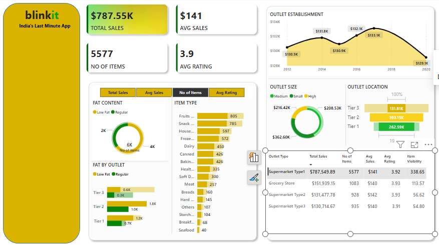

# 🛒 Blinkit Sales Performance & Outlet Trend Analysis – Power BI

## 📌 Project Objective
Designed and developed a fully interactive Power BI dashboard to explore Blinkit’s sales trends, outlet performance, and customer behavior — aimed at supporting retail business decisions through data-driven insights.

## 🛠 Tools & Technologies
- Power BI  
- Excel (for data cleaning & preparation)  
- DAX (for calculated columns and KPI measures)

## 📊 Key Metrics & Visualizations
- **Total Sales**, **Average Sales**, **Number of Items Sold**, **Average Customer Rating**, **Item Visibility**
- Donut chart to analyze **sales by fat content** and understand product performance
- Bar and stacked column charts to compare **item types and fat content across outlet types**
- Line chart to explore **sales trends by outlet establishment year**
- Pie and funnel charts to evaluate **performance by outlet size and location type**
- Table and matrix visuals to provide a **holistic comparison across outlet types**

## 💡 Insights & Business Value
- 🛍️ **Supermarket Type1** led in total sales and item visibility  
- 🏪 **Grocery store** and **Supermarket Type2** had the highest customer ratings  
- 📍 **Tier 3 cities** outperformed Tier 1 & 2 in total sales — surprising retail potential  
- 🧱 **Medium-sized outlets** generated higher sales than both small and large stores  
- 📉 No strong correlation between outlet age and performance, showing varied maturity impact

## 📂 Files Included
- 📄 [Blinkit_Analysis.pbix](https://github.com/elizabethjoyceg/blinkit-powerbi-dashboard/blob/main/Blinkit%20grocery%20sales%20performance%20and%20trend%20analysis.pbix) – Power BI dashboard file  
- 📊 [blinkit_dataset.xlsx](https://github.com/elizabethjoyceg/blinkit-powerbi-dashboard/blob/main/BlinkIT%20Grocery%20Data.xlsx) – Raw dataset used  
- 📸 Dashboard Screenshot:

## 🔗 Live Repository
Explore the full project:  
👉 [GitHub Repository – Blinkit Sales Analysis](https://github.com/elizabethjoyceg/blinkit-powerbi-dashboard)

---

This project demonstrates skills in **retail analytics, interactive dashboarding, and business-focused storytelling** — aligned with real-world decision-making needs in data-driven organizations.
